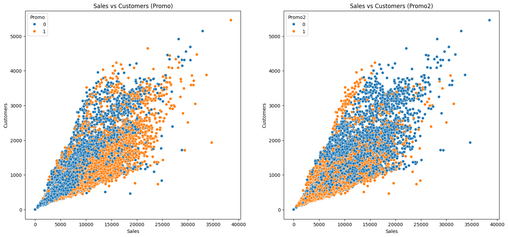
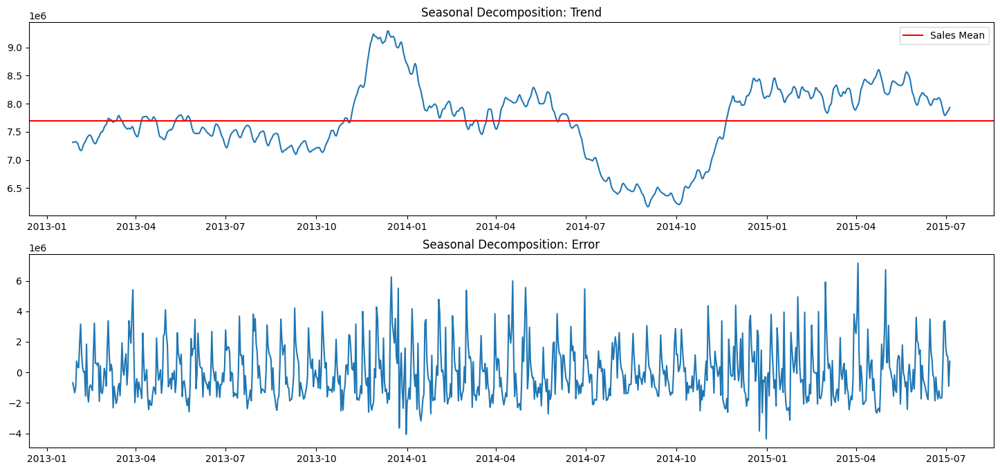
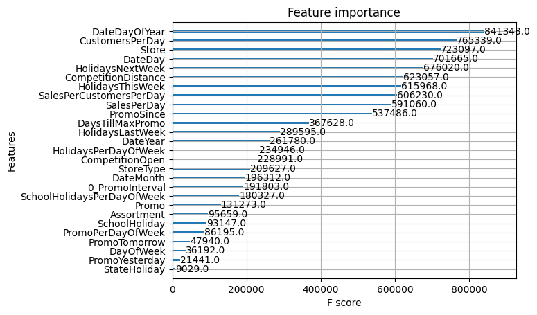

# Rossmann Store Sales Prediction

## Project Overview

This project aims to forecast daily sales for Rossmann drug stores across Germany using store, promotion and competitor data.

     

### Business Goal

The primary business objective is to help Rossmann create more accurate sales forecasts. Reliable predictions will enable store managers to:

1. Create effective staff schedules
2. Increase productivity and employee motivation
3. Focus more on customers and team management
4. Make informed decisions about inventory and resource allocation

### Technical Goal

From a technical perspective, the project involves:

1. Developing a robust machine learning model to predict daily store sales
2. Handling time-series data with various influencing factors
3. Minimizing the Root Mean Square Percentage Error (RMSPE) of predictions

$$ RMSPE = √[ (1/n) * Σ((Actual - Forecast)² / Actual²) ] $$

## Dataset

The dataset provides historical sales data for 1,115 Rossmann stores, including various features that may influence sales:

- Store-specific information (Store Type, Assortment level)
- Time-based features (Date, Day of Week, Year, Month)
- Promotion information (Promo, Promo2, PromoInterval)
- Competitor data (CompetitionDistance, CompetitionOpenSince)
- Holiday information (StateHoliday, SchoolHoliday)

## Approach

My approach to solving this challenge includes:

1. Exploratory Data Analysis (EDA) to understand the relationships between variables
2. Feature engineering to create more informative predictors
3. Time series analysis to capture seasonal trends and patterns
4. Implementation of advanced machine learning algorithms (e.g., XGBoost, LSTM networks)
5. Hyperparameter tuning to optimize model performance
6. Ensemble methods to combine predictions from multiple models

My approach to solving this challenge includes:

1. Exploratory Data Analysis (EDA): To understand the data distribution, correlation patterns, and potential insights.
2. Preprocessing and Feature Engineering: Data cleaning, label encoding, datetime handling etc.
3. Modeling: model training with **XGBoost**.
4. Feature Importance Analysis: To understand which factors most significantly influence order volumes.

## Package used
- Data processing/EDA: pandas, numpy, skimpy
- Visualization: matplotlib, seaborn
- Modeling: sklearn, XGBoost

## Analysis plots (excerpt)

